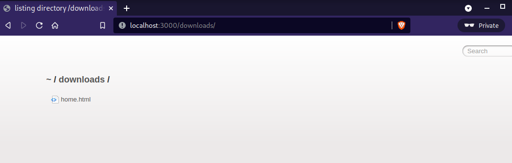
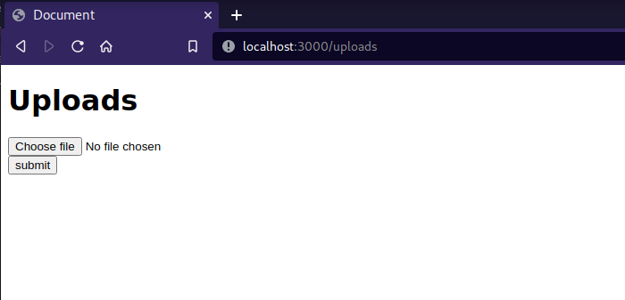

# File Sharing System

### About

This file sharing system uses node server that runs locally and allows uploading and downloading of files from devices on the same network.

2 dvices are on same network if either they are conntected to a common hotspot via wifi or connected using ethernet cables.

If using routers then one may have to configure them slightly to allow the communication between node server and other client on network.

### Goal

Generally when we need to send a file from phone to laptop we are habitual of using some internet based app(generally Whatsapp or even sometimes google drive) where we upload file from phone and then download it from laptop. This is not a good practice as file does not need to travel across the globe just to reach in a device that is a few centimeters from it. So I thought there should be some system where we can ultize local network and transfer files between devices. This website is a small attempt to achieve that goal.

### Usage

Using this repository for local file sharing - 
1. Clone the repository `git clone https://github.com/Raahil2909/fileshare.git`
1. Install node on the system
1. Change the directory `cd fileshare`
1. Download necesaary packages `npm install`
1. Start the server `node server.js`

This will start server at localhost:3000

Home page

Downloads(all files visible here can be downloaded)
The files inside the serve folder are served here 

Uploads route (You can upload file from here)
This submit uploads the file to serve folder

### Future Goals 

1. Better UI
2. Improve performance

Feel free to suggest any ideas and send pull requests if you add some functionality